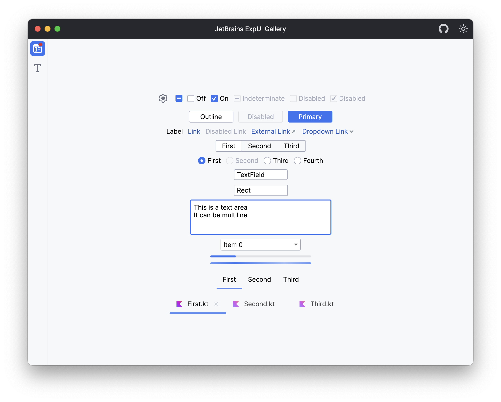
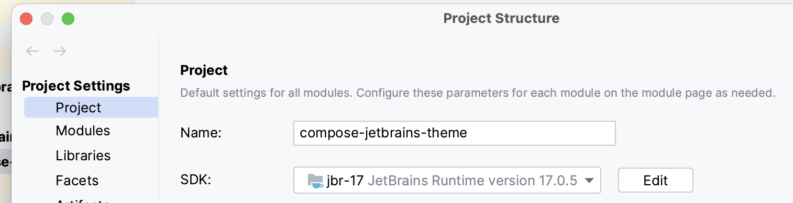
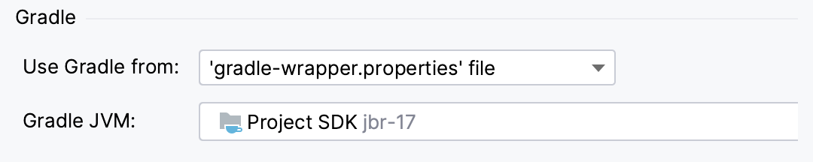

# JetBrains UI Kit for Compose Desktop

New JetBrains style controls and UI kits for [Compose Desktop](https://www.jetbrains.com/lp/compose/).

Classic JetBrains UI kit have been moved to [here](classic).



## Quick Start

## Requirements

### JetBrains Runtime

To get the best presentation across platforms, this library requires the application to run
on [JetBrains Runtime](https://github.com/JetBrains/JetBrainsRuntime) (JBR).

[JetBrains Runtime](https://github.com/JetBrains/JetBrainsRuntime) is a modified version of the JetBrains JDK
distribution, which is widely used across the JetBrains' IDEs such as IntelliJ, GoLand and others.

In this library we use the additional API provided by JetBrains Runtime to customise the title bar in Windows and macOS.

If the `JBWindow` component is not used, it can also be used without the JetBrains Runtime.

When using `JBWindow` in a non-JetBrains Runtime environment, a native title bar may additionally be displayed.

JBR-17 (corresponding to JDK 17) can be downloaded from [the SDK page](https://www.jetbrains.com/help/idea/sdk.html) of
IntelliJ.

Make sure that the [project SDK](https://www.jetbrains.com/help/idea/project-settings-and-structure.html#project-sdk)
and [Gradle JVM](https://www.jetbrains.com/help/idea/gradle-jvm-selection.html) are both JBR-17.

#### Project SDK settings



#### Gradle JVM settings



### `jdk.unsupported` module

Most of the JetBrains Runtime APIs are private to JetBrains, and the class `sun.misc.Unsafe` is used to get access to
these APIs.

You need to add the `jdk.unsupported` module to the compose dependency as in the following code to make it work.

You can also skip this step if you don't need to use the `JBWindow` component.

```kotlin
compose.desktop {
    application {
        nativeDistributions {
            modules("jdk.unsupported")
        }
    }
}
```

## 1. Add dependency

```kotlin
dependencies {
    implementation(compose.desktop.currentOs) {
        exclude("org.jetbrains.compose.material")
    }
    implementation("com.bybutter.compose:compose-jetbrains-expui-theme:2.0.0")
}
```

## 2. Use JBWindow DSL

The optimal display of JBWindow requires JetBrains Runtime, refer to the previous [requirements](#Requirements).

```kotlin
fun main() = application {
    JBWindow(
        title = "JetBrains ExpUI Gallery",
        showTitle = true, // If you want to render your own component in the center of the title bar like Intellij do, disable this to hide the title of the MainToolBar (TitleBar).
        theme = LightTheme, // Change the theme here, LightTheme and DarkTheme are provided.
        state = rememberWindowState(size = DpSize(900.dp, 700.dp)),
        onCloseRequest = {
            exitApplication()
        },
        mainToolBar = {
            // Render your own component in the MainToolBar (TitleBar).
            Row(
                Modifier.mainToolBarItem(
                    Alignment.End,
                    true
                )
            ) { // Use the mainToolBarItem modifier to change alignment of components and enable/disable window drag area on this component.
            }
        }) {
        // Window content
    }
}
```

## 3. Use LightTheme and DarkTheme DSL

Since `JBWindow` requires JetBrains Runtime, if you don't want to use the `JBWindow` component, you can also use a
normal `Window` with `LightTheme`/`DarkTheme` DSL.

```kotlin
fun main() = application {
    Window({}) {
        LightTheme {
            // Your components here
        }
    }
}
```