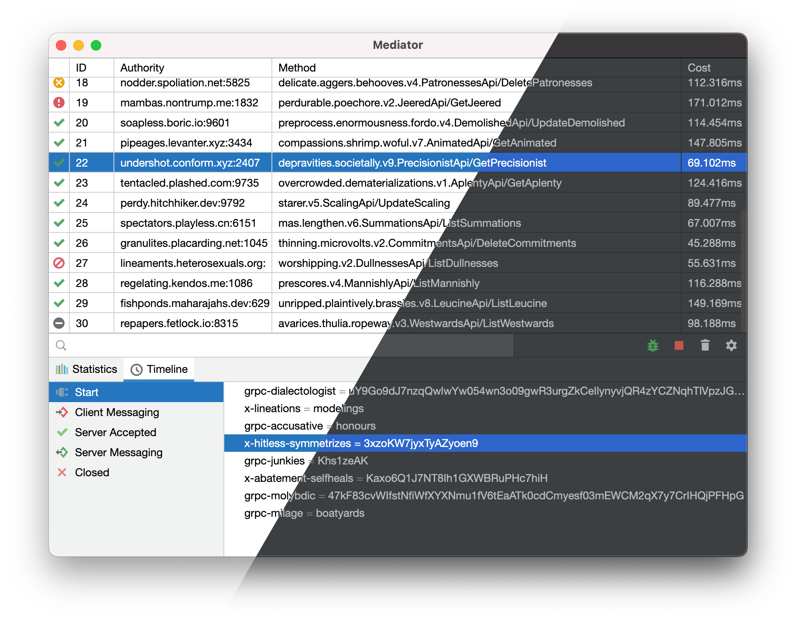

# JetBrains UI Kit for Compose Desktop

JetBrains style controls and UI for [Compose Desktop](https://www.jetbrains.com/lp/compose/).



## Quick Start

## 1. Add dependency

```kotlin
dependencies {
    implementation(compose.desktop.currentOs) {
        exclude("org.jetbrains.compose.material")
    }
    implementation("com.bybutter.compose:compose-jetbrains-theme:2.0.0")
}
```

## 2. JBTheme DSL

```kotlin
fun main() = application {
    Window(
        onCloseRequest = ::exitApplication,
        title = "Compose for Desktop",
        state = rememberWindowState(width = 300.dp, height = 300.dp)
    ) {
        val count = remember { mutableStateOf(0) }

        JBTheme {
            JPanel(Modifier.fillMaxSize().jBorder(top = 1.dp, color = JBTheme.panelColors.border)) {
                Column(Modifier.fillMaxSize(), Arrangement.spacedBy(5.dp)) {
                    Button(modifier = Modifier.align(Alignment.CenterHorizontally),
                        onClick = {
                            count.value++
                        }) {
                        Text(if (count.value == 0) "Hello World" else "Clicked ${count.value}!")
                    }
                    Button(modifier = Modifier.align(Alignment.CenterHorizontally),
                        onClick = {
                            count.value = 0
                        }) {
                        Text("Reset")
                    }
                }
            }
        }
    }
}
```